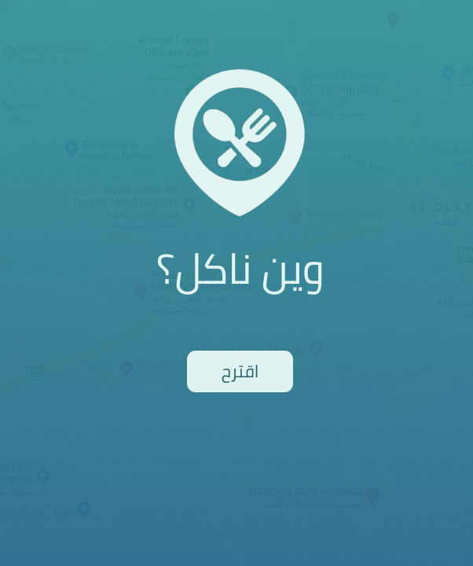

<h1 align="center">
<a href="https://reemharbi.github.io/wain-nakl" target="_blank"> Wain-Nakl </a>
 </h1>

  

# Project Description:
##### Wain-nakl is a restaurant suggestiion generator. Based on a user's geolocation it will generate a random restaurant nearby as a suggestion. It was built using the following technologies: 

## Technologies Used:
- ReactJs
- Google Maps API
- HTML
- CSS
- React-Loadingg

## Installation:
- Fork and clone the repository
- CD into the directory of wain-nakl and run `npm install` to install all dependencies
- then run `npm start` to start the application
- You can also visit the deployed website of the project on: http://reemharbi.github.io/wain-nakl

### Project done by:
##### Reem AlHarbi - reemharbi.3@gmail.com